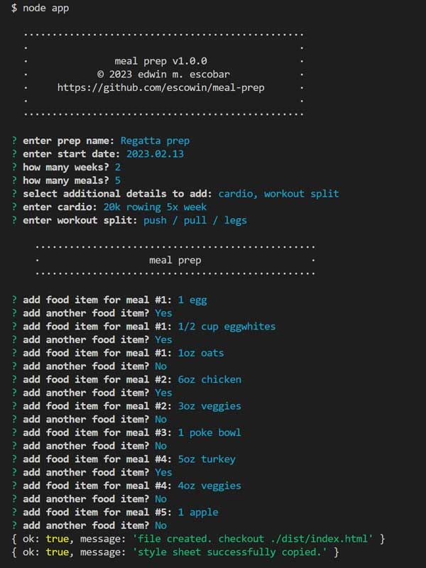

# meal-prep

## Description
[Repo](https://github.com/esowin/meal-prep)


node app captures cli input & generates a corresponding html file.

## Table of Contents
- [Installation](#installation)
- [Code](#code)
- [Test](#test)
- [Screenshots](#screenshots)

- [Author](#author)

## Installation
Run the following command to install necessary dependencies:
```
$ npm i; node app;
```

## Test
Run the following command to run tests:
```
n/a
```

## Code
- Languages: CSS, Javascript

- Frameworks: Node

- Libraries: inquirer


## Screenshots


## Author
### Edwin M. Ecobar
- [Email](mailto:edwin@escowinart.com)
- [GitHub](https://github.com/esowin)
