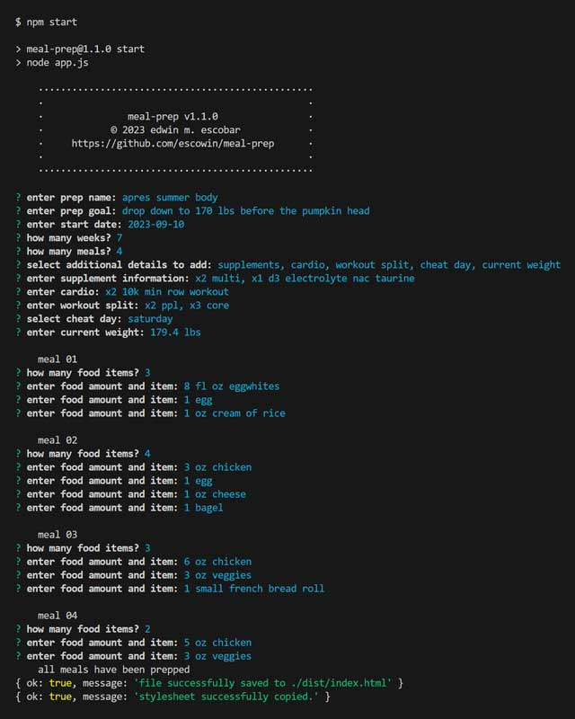
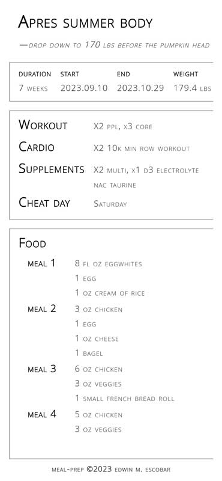

# meal-prep

## Description
[Repo](https://github.com/escowin/meal-prep)

This Node application serves as a convenient tool for capturing meal prep data input by users via the terminal. This information is used to write & present a responsive data-rich webpage using template literals.

Leveraging TDD & mock data to speed up the development process was the biggest take away. Through Jest, helper functions could be built & tested quickly to ensure proper data handling. Mock data played a crucial role in being able to bypass inquirer prompts in order to immediately focus on troubleshooting promise-based logic when necessary.

This app follows the through line in all my development: separation of concerns. the codebase is modularized based on purpose. To achieve this, the codebase is structured in a modular fashion, with functions designed specifically to return data. This design facilitates an initial init() call followed by subsequent .then() chaining, enhancing the overall clarity and organization of the codebase.

I returned to this app to become further familar with ES6 syntax refactoring, `for` loop iteration, `await` promise fullfillment, and error handling while also keeping the codebase legible. Future development will include much the same with possible database integration.

## Table of Contents
- [Installation](#installation)
- [Test](#test)
- [Usage](#usage)
- [Features](#features)
- [Credits](#credits)
- [Author](#author)

## Installation
Run the following command to install necessary dependencies:
```
$ npm i
```

## Test
Run the following command to run tests:
```
$ npm run test
```

## Usage
Run the following command to run app:
```
$ npm start
```





## Features
- user capture through terminal
- data validation & error handling
- responsive web design

## Credits
- Languages: CSS, Javascript
- Frameworks: [Node](https://nodejs.org/en), [Jest](https://jestjs.io/)
- Libraries: [inquirer](https://github.com/SBoudrias/Inquirer.js/blob/master/packages/inquirer/README.md)

## Author
### Edwin Escobar
- [Email](mailto:edwin@escowinart.com)
- [GitHub](https://github.com/escowin)
